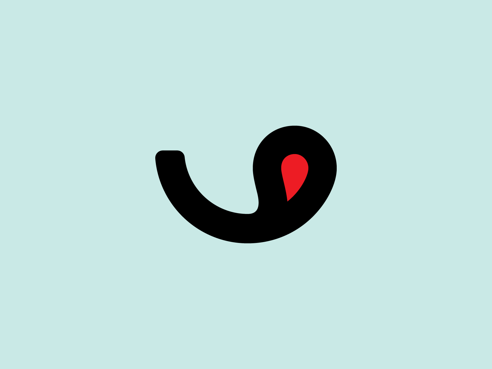

# FoodApp

In this app I focused on implementing an interactive & beautiful design for a sample food ordering app!
It's still an uncomplete project but good enough for my purpose!

<!-- ## Features
- Saving photo to external storage
- viewing saved & favorite photos (todo) -->

## Tech stack & Open-source libraries
This project is based on MVVM architecture, using following tech-stacks:
- Jetpack
  - Lifecycle
  - View Binding
  - Navigation Component
  - Hilt (todo api)
  - Retrofit (todo api)
- Glide
- Coroutines
- [Image Carousel](https://github.com/ImaginativeShohag/Why-Not-Image-Carousel)
- [OTP View](https://github.com/mukeshsolanki/android-otpview-pinview)
- [Circle Image View](https://github.com/hdodenhof/CircleImageView)
- [Power Spinner](https://github.com/skydoves/PowerSpinner)
- [Image Picker](https://github.com/Dhaval2404/ImagePicker)
- [Toasty](https://github.com/GrenderG/Toasty)
- [Circle Indicator](https://github.com/ongakuer/CircleIndicator)

## How to use?
Build & install or [Get .APK](https://github.com/behnawwm/foodapp/raw/master/apk/FoodApp.apk)

## Screenshots:

  
  
  
  
  
  
  
  
  
  
  
  
  
  
  

<!-- ## Architecture
This app is based on MVVM architecture and a repository pattern.

 -->

## Credits
Main design by: [Akila Weerakoon](https://www.behance.net/akilaweerakoon)

Logo by: [Omnium](https://dribbble.com/omniumstudio)

